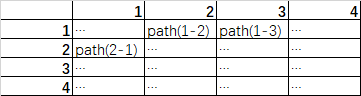

# 2019华为精英挑战赛总结
## 数据结构
#### 车辆
&emsp;这里将车辆封装成一个类，将车辆的状态，基本信息都存储于车辆的实例对象当中。

**属性：**
- 实际出发时间
- 路径
- 最高车速
- 起点
- 目的地
- 下一次转向

**方法：**
- 更新位置
- 初始化
****

#### 道路
&emsp;道路也是封装成一个类将状态和基础信息存储与实例对象当中

**属性：**
- 道路长度
- 道路限速
- 车道状态数组(双向道路的话就存储于两个不同的对象当中。

**方法**
- 更改道路状态
- 读取道路状态
****
#### 道路及路口的存储
- 这里将道路存储于一个二维数组当中，使用数组下标和道路连接的路口来定位某一条道路。例如：road[i][j]存储的是连接路口 i -> j 的道路。

- 路口信息也是存储于一个数组当中，连接路口的道路按顺时针排放。如下图：

- 使用hashmap存储以路口标志的道路和道路id。

## 路径规划——迪杰斯特拉
&emsp;我们使用的路径规划是迪杰斯特拉算法来计算最优路径，第一步先将所有路口之间的最毒只能路径先计算出来存储于一个二维数组path当中，path的下标也是表示路口id。例如：path[i][j] 存储的是路口i到路口j的最短路径。

## 调度规则
略，详见任务书

##道路更新

## 车辆实际路径规划
&emsp;这里使用了一个list数组存储当前时刻可以上路的车辆（即已经到达出发时间的车辆），每个时刻都检查有没有车可以出发，将车辆放入待出发车辆数组当中。每个时刻道路上的车更新为终态之后都会检查待出发车辆数组查看是否有车可以出发，如当前道路已满则继续等待。车辆出发时从路径数组获取起点和终点的最短路径作为当前行驶路径。

## 死锁
&emsp;根据任务书的描述，道路上的车辆比较多的时候有可能会因为交通规则而导致死锁状态的发生，也有可能发生堵死状态。
- 死锁的判断
	我们判断死锁是根据某个时刻所有道路都没有一辆车可以行使来判断道路已经是死锁状态。
- 解决死锁
	死锁需要通过调度车辆来解决，改变一些车辆路径，往不拥堵或者其他道路行驶。这里就是用到了上面的路径矩阵了。
- 改变路径方法
	如果当前车辆需要进入的道路发生拥堵或者死锁，假如当前需要进入的是直行车道堵住了，则检查左转车道和右转车道是否可行而将车辆调度至其他车道，随后再根据车辆当前位置重新规划路径（也就是从路径数组获取当前地点到终点的最短路径）。如果其他车道都不可行，那么就换一辆车从新尝试，遍历整个地图。

